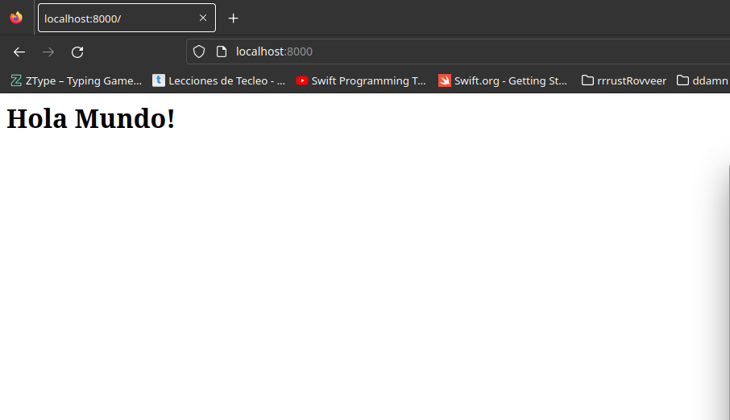
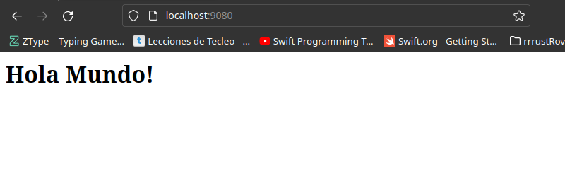
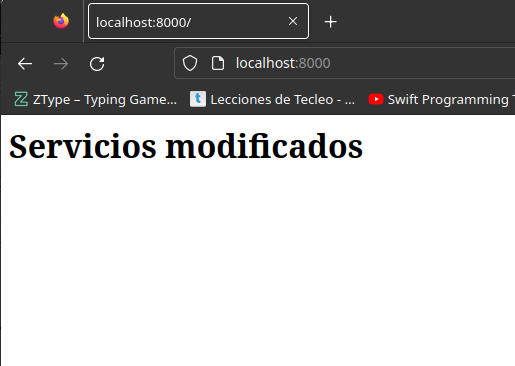
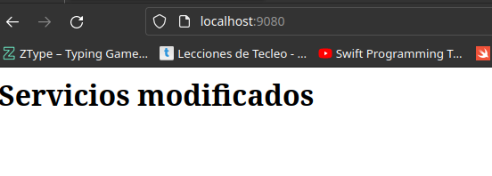

# Tarea 03 :: Comandos Docker

## Enunciado
1. Descarga la imagen 'httpd' y comprueba que está en tu equipo.
```bash
sudo docker pull httpd:2.4

sudo docker images
```

2. Crea un contenedor con el nombre 'dam_web1'.
```bash
sudo docker container create -i -t --name dam-web1 httpd

sudo docker ps -a # comprueba contenedores
```

3. Si quieres poder acceder desde el navegador de tu equipo, ¿que debes hacer?
   Utiliza bind mount para que el directorio del apache2 'htdocs' esté montado un directorio que tu elijas.
```bash
sudo apt install openssh-server

sudo docker run -d --name dam_web1 -p 8000:80 httpd:2.4 # lanza el contenedor

mkdir /home/dam/apacheHost

sudo docker run -d --name dam_web1 -p 8000:80 -v /home/dam/apacheHost:/usr/local/apache2/htdocs httpd:2.4 # mapea el volumen
```

4. Realiza un 'hola mundo' en html y comprueba que accedes desde el navegador.

En la ruta `/home/dam/apacheHost` insertamos el siguiente documento html:
```bash
 <html>
     <head>
         <title>head</title>
     </head>
     <body>
         <h1>Hola Mundo!</h1>
     </body>
 </html>
```
En el navegador si buscamos la siguiente dirección: `http://localhost:8000` aparecerá un "Hola Mundo!"



5. Crea otro contenedor 'dam_web2' con el mismo bind mount y a otro puerto, por ejemplo 9080.
```bash
sudo docker run -d --name dam_web2 -p 9080:80 -v /home/dam/apacheHost:/usr/local/apache2/htdocs httpd:2.4 # crea otro contenedor

sudo docker ps -a # comprobación
```

6. Comprueba que los dos servidores 'sirven' la misma página, es decir, cuando consultamos en el navegador:
   - http://localhost:9080
   - http://localhost:8000
```bash
#accedemos a un navegador e introducimos
 http://localhost:9080 
 http://localhost:8000
```



7. Realiza modificaciones de la página y comprueba que los dos servidores 'sirven' la misma página.
```bash
<html>
     <head>
         <title>welcome mundo!</title>
     </head>
     <body>
         <h1>Servicios modificados</h1>
     </body>
 </html>

#abrimos un navegador e introducimos
 http://localhost:9080 
 http://localhost:8000
```



